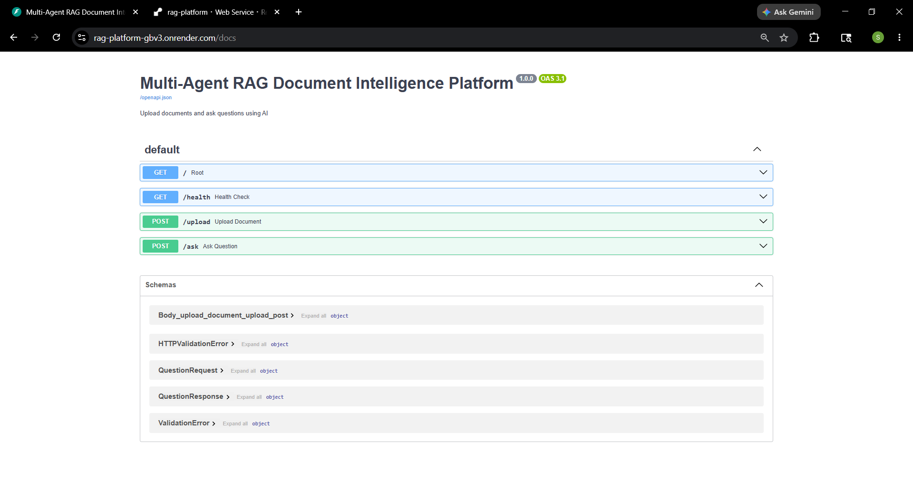
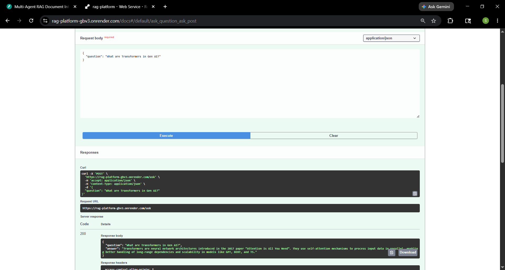

````md
## 🤖 RAG Document Intelligence Platform

Ask questions about PDFs and documents using AI.

Built with:
- FastAPI
- LangChain
- ChromaDB
- Groq Llama 3.1 8B Instant
- FastEmbed
- Docker

---

# 🚀 Features

✅ Upload PDF or TXT documents  
✅ Automatic document chunking  
✅ Lightweight vector embeddings using FastEmbed
✅ Semantic search using ChromaDB  
✅ AI-powered question answering using Groq Llama 3.1 8B Instant
✅ REST API with FastAPI  
✅ Dockerized setup  

---

# 🧠 How It Works

```text
Upload Document
       ↓
Text Extraction
       ↓
Chunking
       ↓
Embeddings Generation
       ↓
Store in ChromaDB
       ↓
Ask Question
       ↓
Retrieve Relevant Chunks
       ↓
LLM Generates Answer
````

This architecture is called:

### Retrieval Augmented Generation (RAG)

---

## 📁 Project Structure

```text
rag-platform/
│
├── main.py
├── rag_chain.py
├── requirements.txt
├── Dockerfile
├── docker-compose.yml
├── .gitignore
├── README.md
└── chroma_db/
```

---

## ⚙️ Tech Stack

| Component        | Technology     |
| ---------------- | -------------- |
| Backend API      | FastAPI        |
| LLM              | Groq Llama     |
| Embeddings       | FastEmbed      |
| Vector Database  | ChromaDB       |
| Framework        | LangChain      |
| Containerization | Docker         |

---

## 🔑 Environment Variables

Create `.env`
```env
GROQ_API_KEY=your_groq_api_key
``````
---

## 🛠 Local Setup

## 1. Clone Repo

```bash
git clone https://github.com/JavSanthosh/rag-document-intelligence-platform
cd rag-document-intelligence-platform
```

---

## 2. Create Virtual Environment

### Windows

```bash
py -3.11 -m venv venv
venv\Scripts\activate
```

### Mac/Linux

```bash
python3 -m venv venv
source venv/bin/activate
```

---

## 3. Install Dependencies

```bash
pip install -r requirements.txt
```

---

## 4. Run Application

```bash
uvicorn main:app --reload
```

---

## 🐳 Docker Setup

## Build and Run

```bash
docker-compose up --build
```

---

## 📌 API Endpoints

| Endpoint  | Method | Description     |
| --------- | ------ | --------------- |
| `/`       | GET    | API status      |
| `/health` | GET    | Health check    |
| `/upload` | POST   | Upload document |
| `/ask`    | POST   | Ask questions   |

---
## 🌐 Live Deployment

API URL:

```text
https://rag-platform-gbv3.onrender.com/
```

Swagger Docs:

```text
https://rag-platform-gbv3.onrender.com/docs
```

---

## 🧪 Example Question

```json
{
  "question": "Summarize the document"
}
```

---

## 📦 Example Response

```json
{
  "question": "Summarize the document",
  "answer": "The document discusses..."
}
```

---

## 🐛 Common Errors

| Error                | Fix                               |
| -------------------- | --------------------------------- |
| Missing dependencies | `pip install -r requirements.txt` |
| Invalid API key      | Check `.env`                      |
| Port already in use  | Change port                       |
| ChromaDB issues      | Delete `chroma_db/`               |

---

## 🔒 Security

Never upload:

* `.env`
* API keys
* secrets

Use `.gitignore`.

---
## 📸 Screenshots

## Swagger API Documentation


---

## Document Upload



---

## AI Question Answering


---


## 📌 Disclaimer

This is a personal educational project built for learning and portfolio purposes.

---

## 👨‍💻 Author
Santhosh

