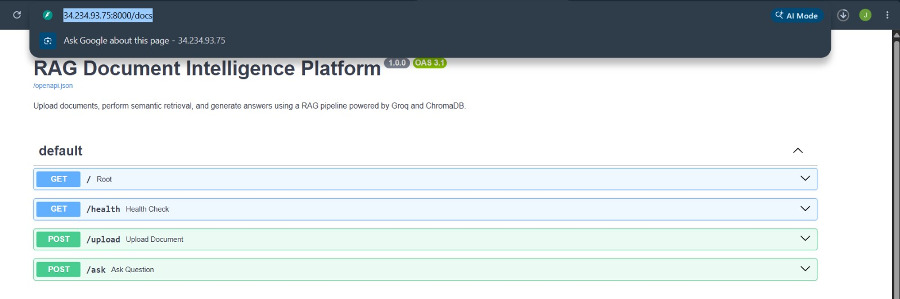
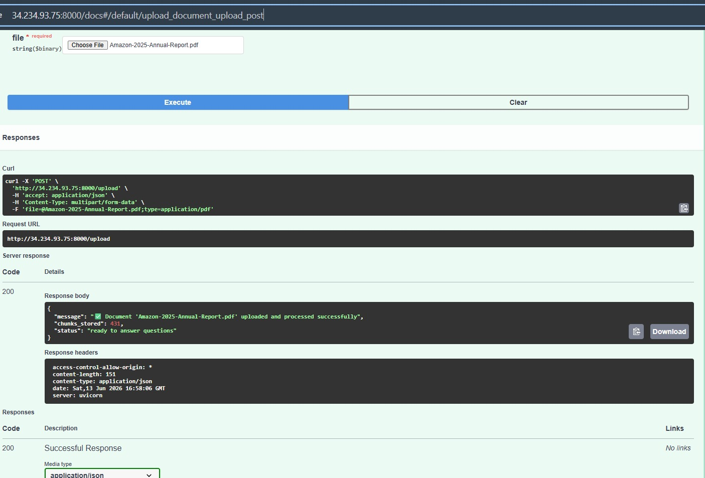
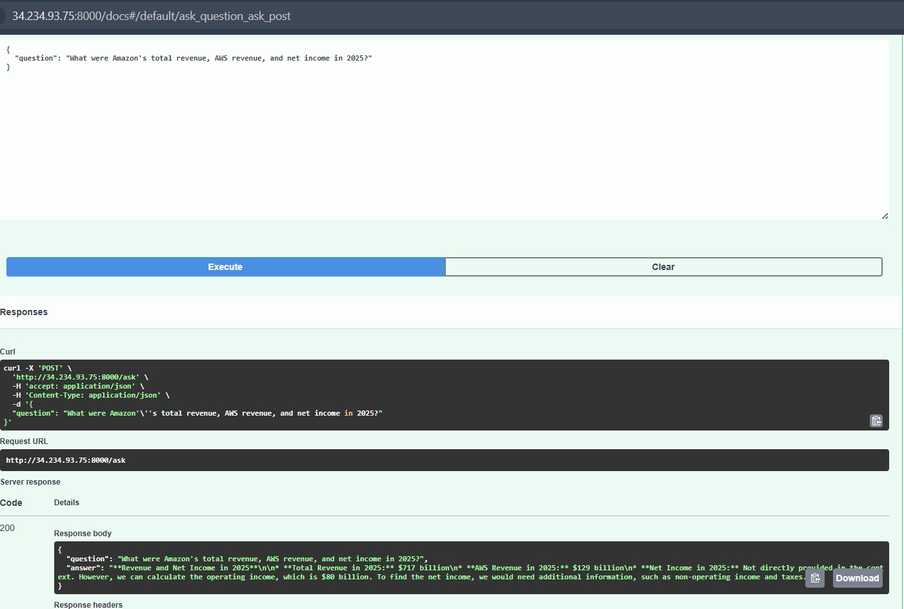
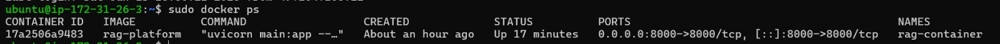
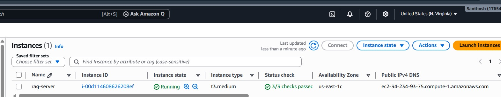

# 🤖 RAG Document Intelligence Platform

A production-ready Retrieval-Augmented Generation (RAG) platform that enables users to upload PDF/TXT documents, perform semantic retrieval using vector embeddings, and generate context-aware answers using Groq Llama 3.1.

Built with:

* FastAPI
* LangChain
* ChromaDB
* Groq Llama 3.1 8B Instant
* FastEmbed
* Docker
* AWS EC2

---

## 🚀 Features

✅ Upload PDF or TXT documents

✅ Automatic document chunking

✅ Lightweight vector embeddings using FastEmbed

✅ Semantic search using ChromaDB

✅ AI-powered question answering using Groq Llama 3.1 8B Instant

✅ REST API with FastAPI

✅ Dockerized deployment

✅ AWS EC2 hosting

---

## 🎯 Key Highlights

* Recursive Chunking (1000 size / 200 overlap)
* FastEmbed Embeddings
* ChromaDB Vector Database
* Top-K Semantic Retrieval
* Groq Llama 3.1 Integration
* Dockerized Deployment
* AWS EC2 Hosting
* Health Monitoring Endpoint

---

## 🧠 How It Works

```text
Upload Document
       ↓
Text Extraction
       ↓
Chunking
       ↓
Embeddings Generation
       ↓
Store in ChromaDB
       ↓
Ask Question
       ↓
Retrieve Relevant Chunks
       ↓
Groq Llama 3.1
       ↓
Generate Answer
```

### Retrieval-Augmented Generation (RAG)

The platform combines semantic retrieval with large language models to generate accurate, context-aware answers grounded in uploaded documents.

---

## ☁️ Deployment

The application is containerized using Docker and deployed on AWS EC2.

Deployment Stack:

* AWS EC2 (Ubuntu)
* Docker
* FastAPI
* ChromaDB
* Groq Llama 3.1

Deployment Workflow:

```text
GitHub
  ↓
AWS EC2
  ↓
Docker Container
  ↓
FastAPI Service
```

---

## 📁 Project Structure

```text
rag-document-intelligence-platform/
│
├── main.py
├── rag_chain.py
├── requirements.txt
├── Dockerfile
├── docker-compose.yml
├── .gitignore
├── README.md
├── screenshots/
│   ├── swagger.png
│   ├── upload.png
│   └── ask.png
└── chroma_db/
```

---

## ⚙️ Tech Stack

| Component        | Technology                |
| ---------------- | ------------------------- |
| Backend API      | FastAPI                   |
| LLM              | Groq Llama 3.1 8B Instant |
| Embeddings       | FastEmbed                 |
| Vector Database  | ChromaDB                  |
| Framework        | LangChain                 |
| Containerization | Docker                    |
| Deployment       | AWS EC2                   |

---

## 🔑 Environment Variables

Create a `.env` file:

```env
GROQ_API_KEY=your_groq_api_key
```

---

## 🛠 Local Setup

### Clone Repository

```bash
git clone https://github.com/JavSanthosh/rag-document-intelligence-platform.git

cd rag-document-intelligence-platform
```

### Create Virtual Environment

#### Windows

```bash
py -3.11 -m venv venv
venv\Scripts\activate
```

#### Linux / Mac

```bash
python3 -m venv venv
source venv/bin/activate
```

### Install Dependencies

```bash
pip install -r requirements.txt
```

### Run Application

```bash
uvicorn main:app --reload
```

Application:

```text
http://localhost:8000
```

Swagger Docs:

```text
http://localhost:8000/docs
```

---

## 🐳 Docker Setup

```bash
docker-compose up --build
```

---

## 📌 API Endpoints

| Endpoint | Method | Description     |
| -------- | ------ | --------------- |
| /        | GET    | API status      |
| /health  | GET    | Health check    |
| /upload  | POST   | Upload document |
| /ask     | POST   | Ask questions   |

---

## 🧪 Example Request

```json
{
  "question": "Summarize the document"
}
```

---

## 📦 Example Response

```json
{
  "question": "Summarize the document",
  "answer": "The document discusses..."
}
```

---

### Swagger API Documentation



### Document Upload



### AI Question Answering



### Docker Container Running



### AWS EC2 Deployment



## 🔒 Security

Never commit:

* .env
* API Keys
* Secrets
* Credentials

Use `.gitignore` properly.

---

## 📌 Disclaimer

This project was built for learning, experimentation, and portfolio purposes.

---

## 👨‍💻 Author

Santhosh
